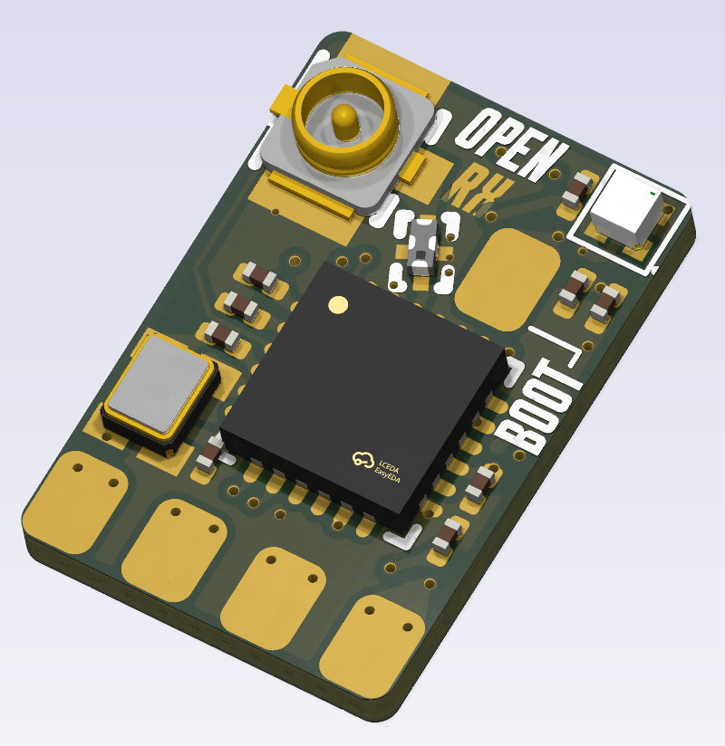
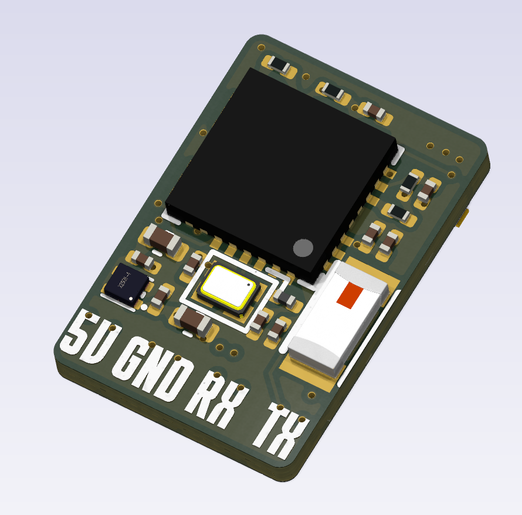

# OpenRX-Lite UFL

ESP32-C3 + SX1281, 2.4GHz only, UFL antenna connector. Same circuit as Lite ceramic, different antenna interface.

## Board Preview

| Front | Back |
|-------|------|
|  |  |

## Schematic

- Main sheet: `esp32c3_sx1281_lite.kicad_sch`
- RF chain: `SX1281 RFIO (pin 22) → 2450FM07D0034 (FL1) → U.FL-R-SMT-1(80) (JP1)`
- AE1 (2450AT18A100E) still in BOM — DNP or WiFi antenna for ESP32-C3
- No RF front-end (PA/LNA), no RF switch, no sub-GHz
- 2450FM07D0034 output is 50 ohm → U.FL is 50 ohm. Clean match.

### GPIO Map

Same as Lite ceramic — see `OpenRX-Lite/DESIGN.md`.

### No Boot Button

Same as Lite ceramic — GPIO9 pull-up only, no physical switch.

## Firmware

- ELRS target: `Unified_ESP32C3_2400_RX` (same as ceramic Lite)
- Hardware JSON: `/shared/elrs-targets/OpenRX Lite 2400.json`

## Flash Interface

- Pads: `5V`, `GND`, `RX`, `TX`
- `BOOT` pad: short to GND during power-up to enter UART download mode
- Use Wi-Fi OTA after first flash

## Sourcing

- All parts LCSC basic/preferred where possible
- `C2651081` 2450FM07D0034 — 2.4GHz bandpass filter
- `C2151551` SX1281IMLTRT — watch stock for volume runs
- `C88374` U.FL-R-SMT-1(80) — antenna connector
