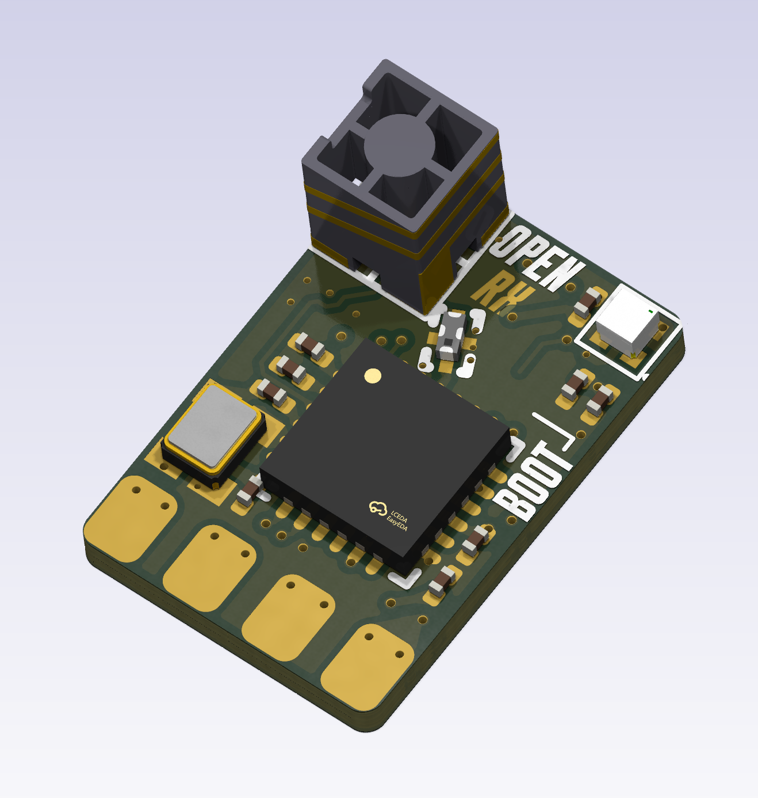
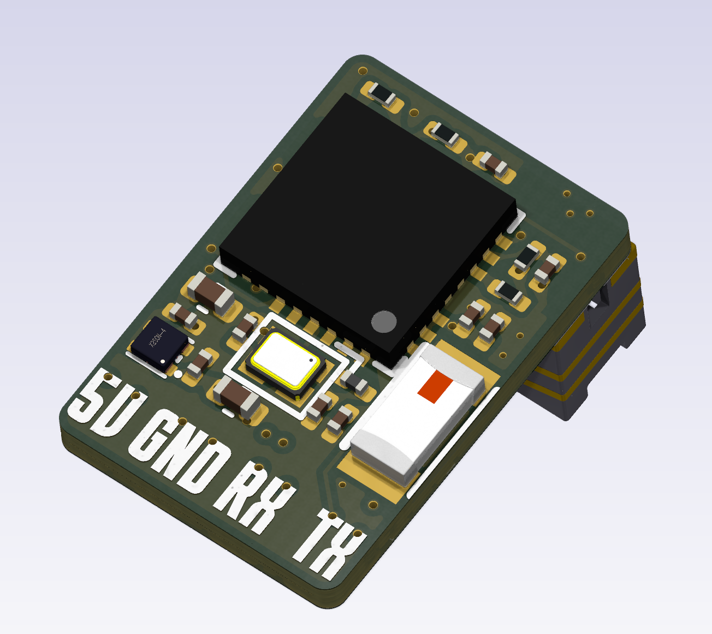

# OpenRX-Lite (Ceramic Antenna)

ESP32-C3 + SX1281, 2.4GHz only, ceramic antenna. Smallest and cheapest OpenRX receiver.

## Board Preview

| Front | Back |
|-------|------|
|  |  |

## Schematic

- Main sheet: `esp32c3_sx1281_lite.kicad_sch`
- RF chain: `SX1281 RFIO (pin 22) → 2450FM07D0034 (FL1) → 2450AT18A100E (AE1)`
- No RF front-end (PA/LNA), no RF switch, no sub-GHz
- 2450FM07D0034 pin 1 (40 ohm) matched to SX1281 RFIO — no mismatch
- TX power limited to SX1281 native +12.5 dBm (no PA)

### GPIO Map

| GPIO | Function |
|---|---|
| 2 | RST |
| 3 | BUSY |
| 4 | SCK |
| 5 | DIO1 |
| 6 | MISO |
| 7 | MOSI |
| 8 | NSS |
| 10 | LED |

Note: SPI pin mapping differs from Mono/Gemini. Lite uses GPIO4=SCK, GPIO6=MISO, GPIO7=MOSI, GPIO8=NSS. Mono uses GPIO6=SCK, GPIO5=MISO, GPIO4=MOSI, GPIO7=NSS. Different hardware.json required.

### No Boot Button

GPIO9 has a 10K pull-up but no physical switch. Enter UART download mode by shorting the BOOT pad to GND during power-up. WiFi mode cannot be entered at runtime without UART — firmware must be pre-configured or OTA-enabled on first flash.

## Firmware

- ELRS target: `Unified_ESP32C3_2400_RX`
- Hardware JSON: `/shared/elrs-targets/OpenRX Lite 2400.json`
- `power_values: [13]` — single power level, +12.5 dBm SX1281 native output

## Flash Interface

- Pads: `5V`, `GND`, `RX`, `TX`
- `BOOT` pad: short to GND during power-up to enter UART download mode
- Use Wi-Fi OTA after first flash

## Sourcing

- All parts LCSC basic/preferred where possible
- `C2651081` 2450FM07D0034 — 2.4GHz bandpass filter
- `C2151551` SX1281IMLTRT — watch stock for volume runs
- `C89334` 2450AT18A100E — ceramic chip antenna
